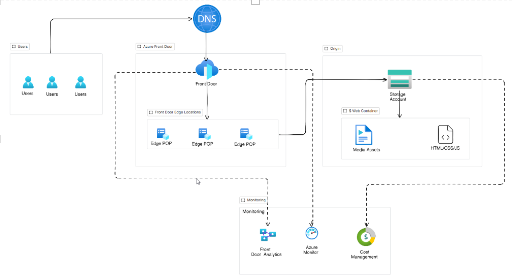

# Azure Static Website Project

## Tasks

Deploy static site, integrate Azure Front Door, enable HTTPS  

## Objective

Design and deploy a static website using Azure Storage, integrate Azure Front Door to deliver low‑latency global access and enforce HTTPS to ensure secure and encrypted connections.

## Problem Statement

Users across multiple regions are experiencing high latency, and the current configuration does not enforce secure, encrypted HTTPS access to the website.

Architecture Overview 

Hosting 

The static website will be hosted on an Azure Storage account using the Static Website hosting feature. 

All web content (HTML, CSS, JavaScript and media assets) are stored in the $web container with Azure Blob Storage 

Users do not access storage endpoint directly; instead the storage account acts the backend origin for Azure Front Door 

Azure Front Door (AFD) 

When a user accesses a website, the browser sends a DNS query that resolves the Microsoft Anycast IP  

The AFD global routing system then directs the request to the nearest AFD Edge Point of Presence based on the lowest latency 

If requested content is already stored in the FD edge cache, the cached content is returned directly to the user 

Otherwise, Front Door retrieves the content from the origin (Azure Storage Static Website Endpoint) updates the edge cache and sends the content back to the user 

Cost and Delivery Monitoring 

Cost is monitored using Azure Cost Management feature focusing on bandwidth usage, Front Door offload percentage, origin egress bandwidth to understand traffic patterns and optimize operational expenses.  

Content delivery performance - including cache hit ratio, latency, throughput, edge performance  is monitored using Azure Front Door diagnostic logs, Azure Monitor metrics and Log Analytics to ensure consistent global performance and efficient content distribution.  

Flow: 
  

Components Used 

DNS 

Azure Front Door Endpoint 

Azure Storage Account ($web) 

Azure Front Door Diagnostics & Logs 

Azure Monitor  

Cost Management 
 
Design Decisions 

DNS 

DNS was configured to map custom domain to the Azure Front Door Endpoint. A CNAME record was added to route all traffic through Front Door, allowing it to handle global traffic distribution and enforce HTTPS without exposing the storage origin. 

Azure Front Door (Content Delivery Layer) 

Azure Front Door was selected it provides global edge POPs for low-latency delivery.  

It caches content at the edge, reducing round-trip time and improving page-load performance 

It also offloads traffic from the storage origin, reducing egress costs and improving scalability during peak access. 

Azure Storage Account ($web) 

Azure Storage Static Website hosting was chosen to provide a simple, cost-efficient and highly available origin serving static website content. 

It integrates natively with AFD, allowing AFD to retrieve content directly from the $web container and cache it across the global edge locations. 

This eliminates the need for web server and significantly reduces operational overhead  

Azure Front Door Diagnostics & Logs 

Azure Front Door Diagnostics were selected because it provides native visibility into cache behavior, Edge POP performance, request patterns, origin latency, response times.  

Azure Monitor 

Azure Monitor was selected to track component behavior and performance metrics across the solution, and to generate alerts when thresholds are breached.  

This enables proactive remediation before issues escalate, helps identify performance peaks, and supports future scalability and design improvements by collecting logs and metrics from all components in the architecture. 

Cost Management  

Azure Cost Management was included to track the cost of each component and trigger alerts when spending exceeds defined budgets.  

It enables precise identification of services driving higher‑than‑expected costs and supports future optimization by analyzing usage patterns, cost trends, and component‑level expenditure.  

Implementation Steps 

Step 1: Create the static website origin in Azure Storage 

1.1 Create the Storage Account  

Create a resource group rg-mini-project4 in East US 

Create a storage account in the resource group saminiproject4 in East US 

Preferred storage type Azure Blob Strorage or Azure Data Lake Storage Gen2 

Performance Standard 

1.2 Enable Static Website hosting  

In the left menu, select Static website (under Data management or Data storage, depending on UI). 

Click Enable. 

Index document name: index.html 

Error document path (optional): 404.html (or leave blank for now). 

Click Save.  

1.3 Upload website content to $web 

In the same Storage account, select Containers. 

Open the $web container (it is created automatically when Static Website is enabled). 

Click Upload. 

Upload a simple index.html (<h1> Welcome to my Website </h1>) 

1.4 Verify the static site works 

Copy the Primary endpoint URL from the Static website blade. 

Open it in a browser. 

Make sure the URL ends with .web.core.windows.net. 

Step 2: Create and Configure the CDN Endpoint 

Go to Create a resource  and type CDN Profiles  in the search bar 

Select Front Door and CDN profiles, Create 

Select Azure Front Door and Quick Create and click on Continue to create Front Door 

Select Resource Group  

Enter Profile name: CDN-Profile 

Tier: Standard 

Endpoint name: CND-Endpoint 

Origin type: Storage (Static website) 

Origin host name: saminiproject4 

Enable caching  

Ignore Query String 

Enable compression  

WAF policy not required 

Click on Review + Create 

Confirm deployment  

Endpoint : fd-cdn-endpoint-xxxx.z02.azurefd.net 

Origin group: default-origin-group 

Route: default-route 

All in succeeded state 

Step 3: Verify Route + Origin  

Go to Front Door manager → Endpoints → Routes. 

Confirm: 

Route: default-route 

Domain: fd-cdn-endpoint-cjczahfkcwb2bvat.z02.azurefd.net 

Pattern: /* 

Redirect: HTTP → HTTPS 

Origin group: default-origin-group 

Caching + compression enabled 

Test HTTP: 

Code 

http://fd-cdn-endpoint-cjczahfkcwb2bvat.z02.azurefd.net 

Step 4: Verify HTTPS (Default FD Hostname) 

Open: 

Code 

https://fd-cdn-endpoint-cjczahfkcwb2bvat.z02.azurefd.net 

Confirm: 

Padlock present 

Certificate issued to *.azurefd.net 

No custom domain needed — HTTPS is automatically enabled for default FD hostnames. 

Step 5: Enable HTTPS Redirect  

Go to Front Door manager → Endpoints → Routes 

Select default-route 

Forwarding protocol 

HTTP only 

HTTPS only 

Match incoming request 

Select HTTPS Only  

Step 6: Configure Monitoring & Diagnostics 

6.1  Enable Front Door Diagnostic Logs 

Go to Front Door manager → Diagnostic settings 

Click Add diagnostic setting 

Enable: 

FrontDoorAccessLog 

FrontDoorHealthProbeLog 

FrontDoorMetrics 

Send logs to Log Analytics workspace 

6.2 Enable Metrics in Azure Monitor 

Go to Azure Monitor → Metrics 

Select your Front Door profile 

Add charts for: 

Request count 

Origin latency 

Percentage of 4XX 

Percentage of 5XX 

6.3 Configure Alerts 

Go to: Azure Monitor → Alerts → Create → Alert rule 

On the Create alert rule page: 

Scope: 

Click Select resource 

Search and select your Front Door profile (e.g., fd-cdn-mini-project4) 

Click Apply 

Then: 

Condition (Select a signal e.g. Percentage of 5xx) 

Add Alert Logic 

Actions 

Details – Add name and severity 

Tags 

Review + Create 

Step 7:  Cost Monitoring 

7.1 Navigate to resource group rg-mini-project4 

Under Cost Management select Budgets 

Click add 

Select Name: budget-mini-project4 

Amount: 10 

Set Alerts 

Actual Cost 50% Email 

Actual Cost 80% Email  

Actual Cost 100% Email  

Challenges & Resolutions 

Challenge 1: 

Issue: 

The expected CDN Endpoint option was not available in the Azure Portal during resource creation. Only Front Door and CDN Profiles appeared, causing confusion during setup. 

Cause: 

Microsoft has deprecated the classic Azure CDN service (Microsoft.Cdn) and replaced it with the unified Azure Front Door Standard/Premium platform. As a result: 

Classic CDN endpoints no longer appear in the creation menu 

All new CDN deployments must use Azure Front Door Profiles 

The UI and workflow differ from older documentation 

Resolution: 

Used Azure Front Door Standard to create the CDN profile and endpoint. Front Door now provides: 

Global CDN caching 

Edge POP delivery 

Automatic HTTPS 

Unified routing/origin management 

Modern diagnostics and security features 

This resolved the issue and aligned the deployment with Microsoft’s current recommended architecture. 

Security Considerations 

Azure Front Door 

Acts as a public entry point for the static website  

Ensure HTTPS is enforced for all traffic between client and Edge 

Prevents direct access to the Storage Account origin, reducing exposure limiting attack surface.  

Uses Edge POPS which naturally absorbs and distributes traffic, reducing the impact of sudden spikes and regional load.  

Provides diagnostic logs and metrics, allowing detection of unusual traffic patterns, high error rates, or potential misuse. 

Storage Account  

Fully managed PaaS service - Microsoft handles, platform security, patching and infrastructure hardening.  

Soft delete and versioning help protect against accidental deletion or overwrites.  

All data is encrypted at rest by default.  

Access can be controlled using RBAC, ensuring only authorized users can upload or modify website files 

Azure Monitor  

Alerts help detect abnormal behavior such as high latency, high error rates, or excessive origin egress. 

These signals can indicate performance issues or potential misuse. 

Cost Management 

Cost Management provides indirect security benefits by helping detect unusual or unexpected usage patterns. In this project, a monthly budget was configured with alerts at 50%, 80%, and 100% of the €10 limit. 

This setup helps to: 

Identify unexpected traffic spikes, which may indicate misuse or bot activity. 

Detect abnormal origin egress, suggesting cache bypass or inefficient routing. 

Provide early warning if costs rise faster than expected, supporting proactive investigation. 

Cost Estimation 

Azure Front Door (Standard Profile) 

Azure Front Door is the primary cost‑generating component in this architecture. Costs are based on: 

Data Transfer Out — content delivered from edge POPs to users 

HTTP/HTTPS requests — billed per 10,000 requests 

Origin egress — when Front Door retrieves content from the Storage Account on cache misses 

For a low‑traffic static website, these costs remain minimal. 

Estimated Monthly Cost: €1–€3 

Azure Storage Account (Static Website Hosting) 

The Storage Account hosts the static website content in the $web container. Costs are driven by: 

Storage capacity — storing HTML, CSS, JS files 

Read operations — when Front Door pulls content 

Origin egress — charged only on cache misses 

Because Front Door caches most content, Storage costs remain very low. 

Estimated Monthly Cost: €0.10–€0.50 

Azure Monitor Alerts 

Azure Monitor is used to track performance and detect issues such as high latency, errors, or excessive origin egress. Costs come from: 

Alert rules 

Email notifications 

Only a small number of alerts are configured in this project, so the cost impact is minimal. 

Estimated Monthly Cost: €0.20–€1 

Cost Management (Budgets & Alerts) 

Cost Management is used to track spending and send alerts at 50%, 80%, and 100% of the €10 monthly budget. 

Budgets — free 

Cost alerts — free 

Cost analysis — free 

These tools help detect unexpected spending but do not add to the monthly bill. 

Estimated Monthly Cost: €0 

Total Estimated Monthly Cost 

For this mini‑project: 

€1.50 – €4.50 per month 
